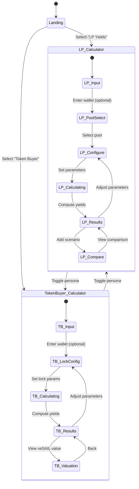
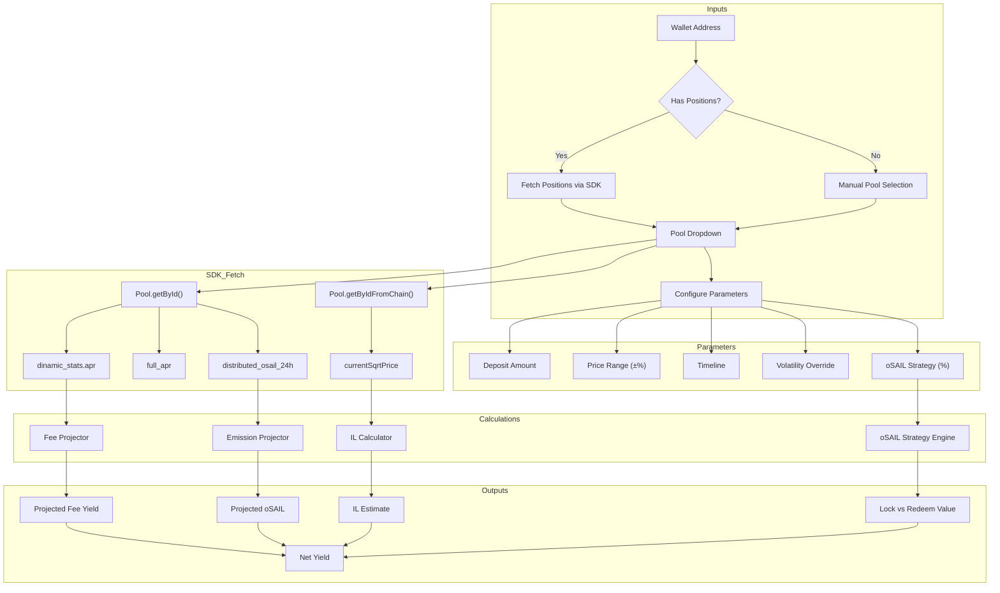
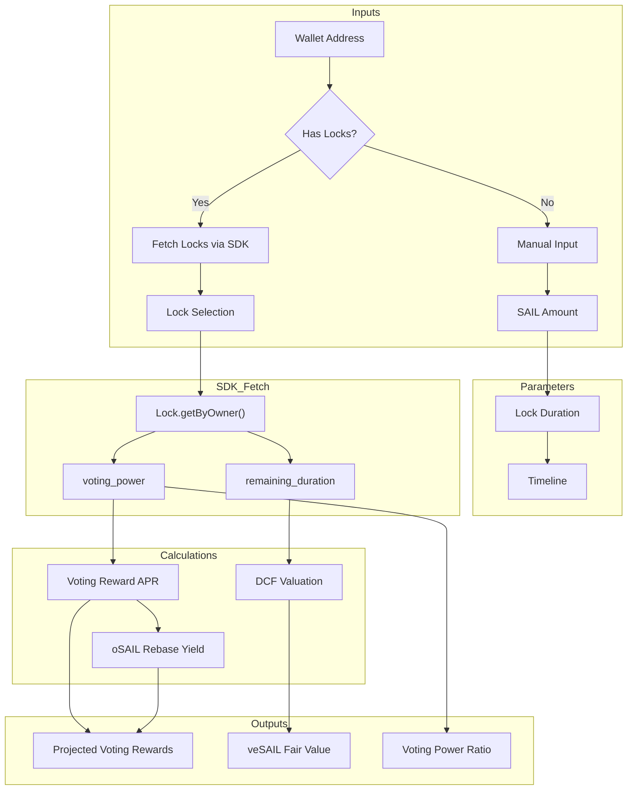
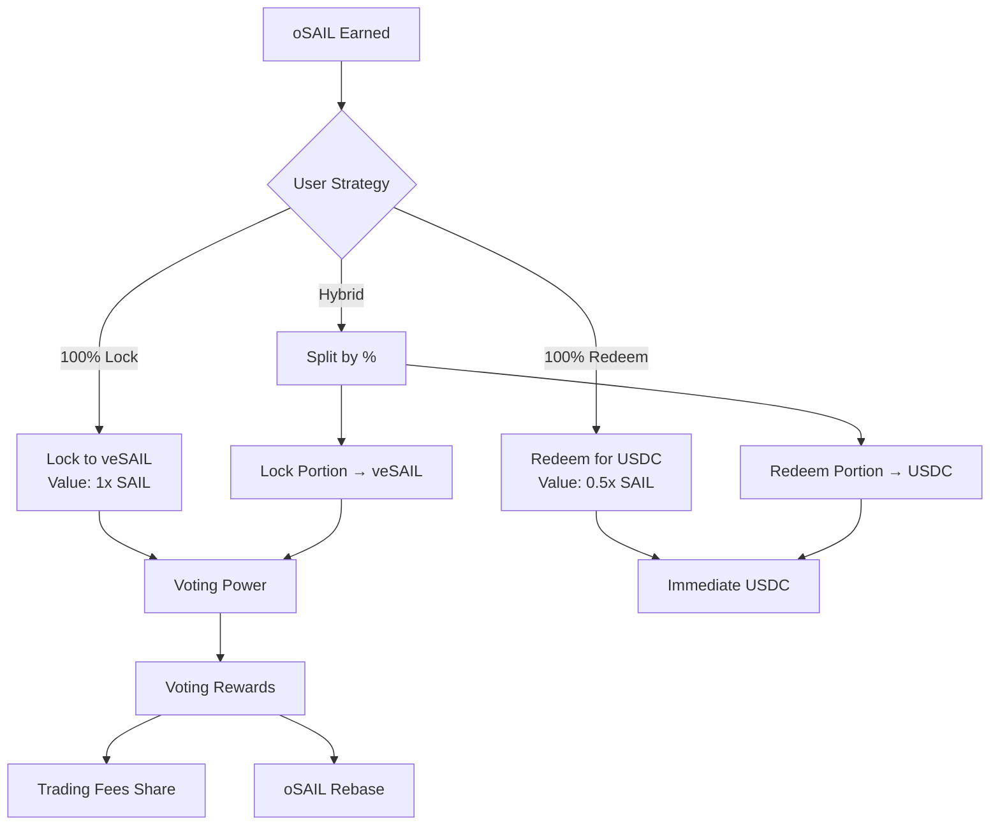
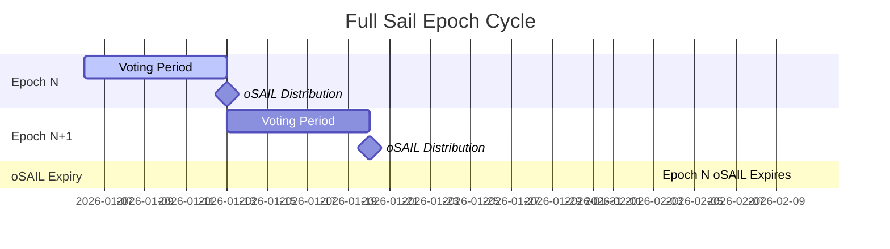

# Full Sail Yield Calculator - State Diagram

## Application State Machine

---

## LP Calculator Data Flow

---

## Token Buyer Calculator Data Flow

---

## oSAIL Strategy Decision Tree

---

## Epoch Timeline

